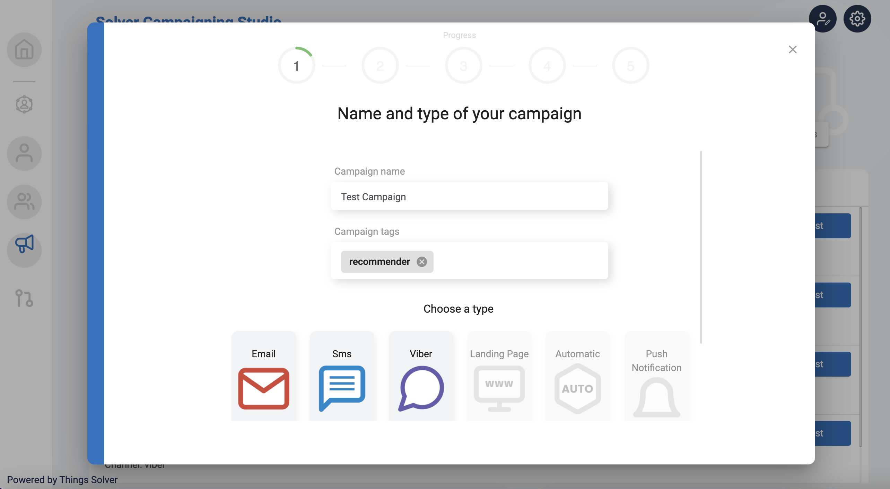
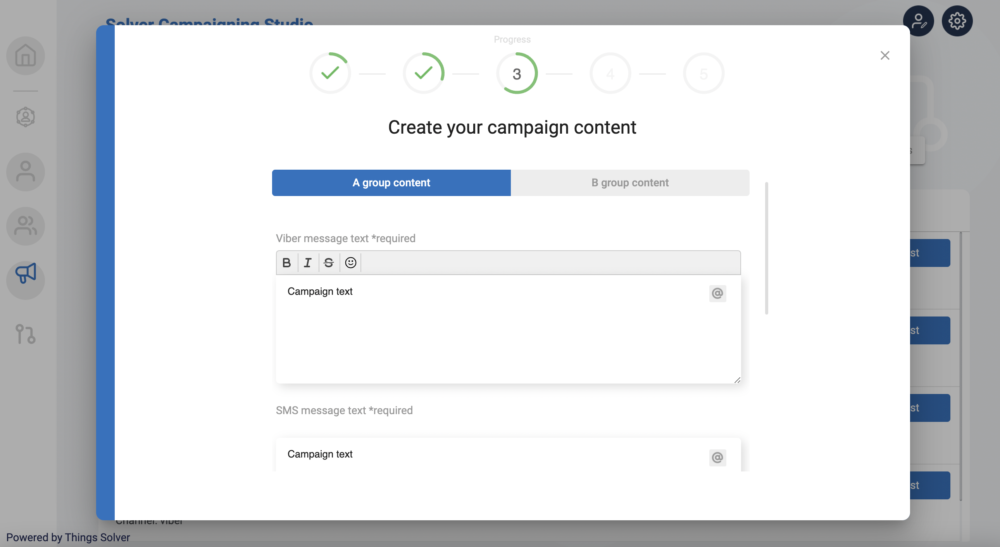
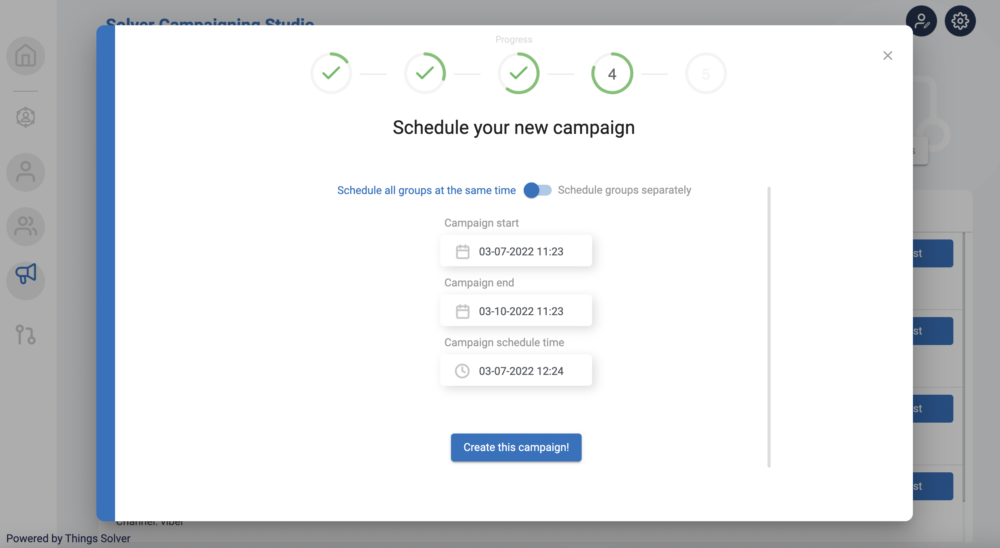
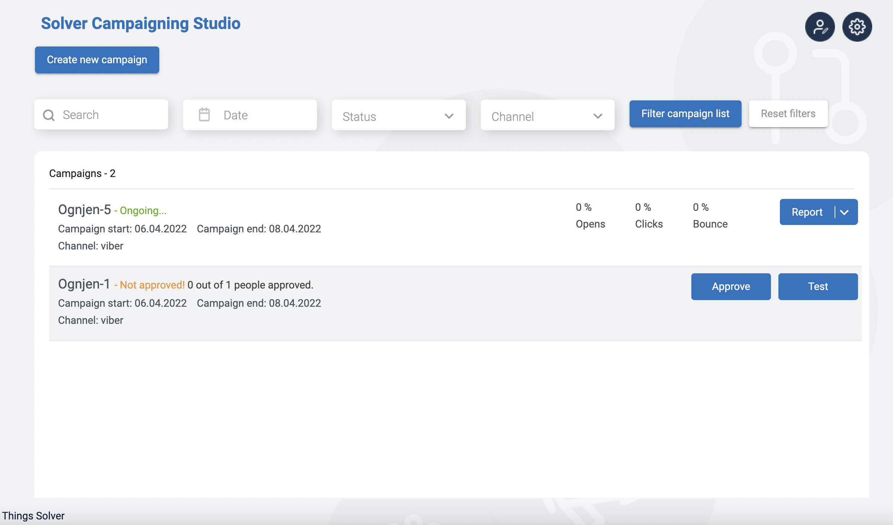

# Campaigning Studio

For full API documentation for Campaigning visit api.thingsolver.com

## Overview

Campaigning studio is ... @biznis da opise  

Solver Campaigning Studio is not just a tool for campaign management, it is a tool that enables you to automatically trigger campaigns over channels that are most likely going to motivate your lead to convert into your customer and your customer to convert into a loyal brand ambassador. 

The foundation of Solver Campaigning Studio lies on complex AI and ML models that enable you to get seamless user experience and to utilize marketing efforts to the maximum.

In this module user can:
* Create new Campaign
* Upload or create specific Audience
* Select communication channel
* Schedule new Campaign

## Channels 

- :fontawesome-brands-html5: __HTML__ for content and structure
- :fontawesome-brands-js: __JavaScript__ for interactivity
- :fontawesome-brands-css3: __CSS__ for text running out of boxes
- :fontawesome-brands-internet-explorer: __Internet Explorer__ ... huh?

## Viber 

Solver Campaigning Studio offer non personalized and personalized campaigns, and still those two approaches can be combined through one single campaign, include control campaign (A/B/C) testing

### Non-personalized campaigns

### Personalized campaigns

#### What is personalized campaign and how it works
Campaign Studio allows users to create a Campaign, define channels, and connect it with the exact Audience. 
The campaign has the main aim to convert customers and to offer them through campaign personalization offers. 
  

### Prerequisites

###The flow of creating a Campaign

**Name and type**

In the first step the user needs to define:
* Campaign name
* Campaign tags
* Campaign type (email, Viber, SMS, landing page, push notifications)

**Choose your target group**

In this step you need to define: 
* To whom the campaign will be sent
  + Create a new Audience  
  + Search for already created audience
 
+ Option for А/B testing - possibility of sending different content to a specific group of users inside an Audience group
  - Defining the percentage in groups of total Audience (A, B and/or C)
* From whom the campaign is sent (defining the sender name)

**Campaign content**

In this step you should define the exact message of the campaign divided into (depending on type of the campaign): 
* Viber message text
* SMS message text
* Button text
* Button URL
* Option for using a template or creating a template
  + Image URL (for creating a template) or
  + Automatically personalized template 
* Validity period
* Validity unit

*Creating Campaign content*

**Schedule campaign**

In this step you can define: 
* Date when the campaign starts
* Date when the campaign ends
* Scheduled time with the exact hour when the campaign starts

**Campaign overview**

This is the last step in creating a campaign. The most important information already selected is listed: 
* Audience name (to whom it will be sent)
* From (name of the sender)
* Campaign content 
* Start and end date of the campaign
* Campaign promotion time
* Campaign estimate cost

**Campaign Dashboard**

On the campaign dashboard you can search for your campaign by name, date, status or channel.
See whether your campaign is approved or test your campaign to double check if everything's at its right place. 

Click on **Report** to access all the metrics including how many people opened or have seen the campaign, average basket value, average basket size or generated revenue. 
On this page you can also find open, clicks and bounce rates.

*Solver Campaigning Studio Dashboard*

