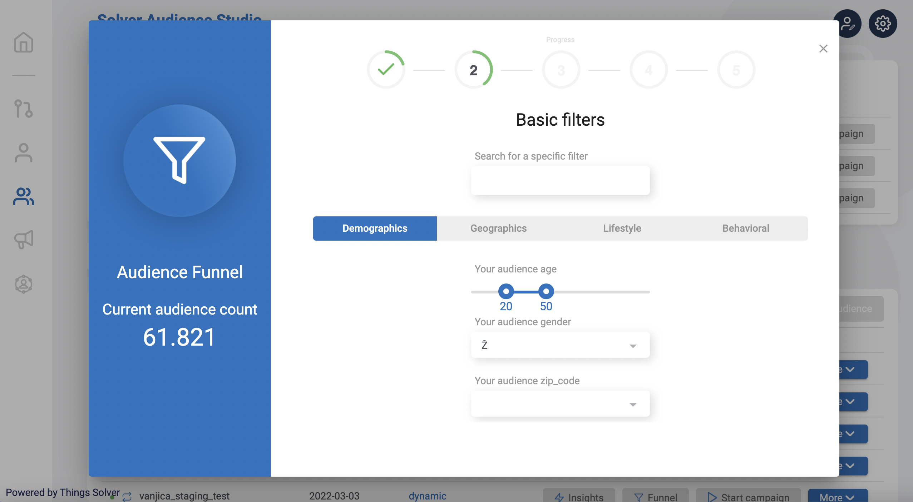
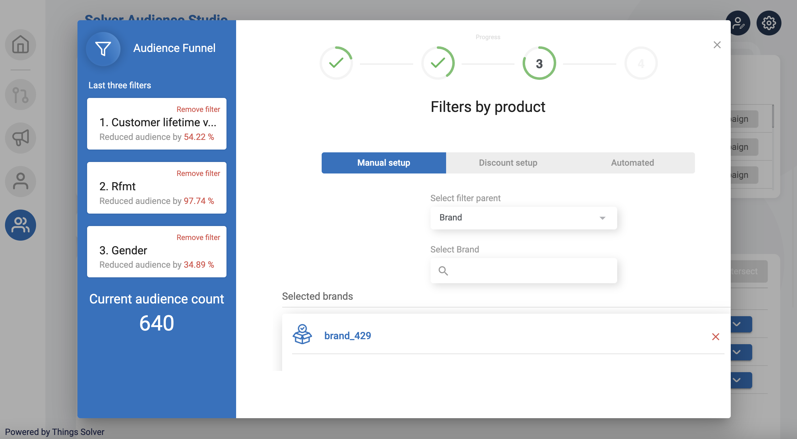
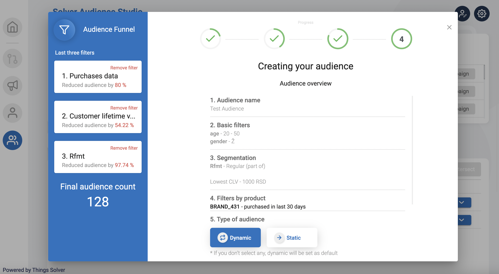

# Audience Studio

For full API documentation for Audience visit api.thingsolver.com

## Overview

Audience studio is ... @biznis da opise  

Solver Audience Studio helps you create meaningful customer groups based on multiple criteria not visible in standard BI tools and deeply understands their behaviour with help of AI models. 

Being able to develop a specific customer segment and recognize their distinct buying patterns and behaviour, it enables you to create data-driven marketing, sales actions & campaigns that will deliver above industry standards converting campaigns and ROI.

In this module user can:
* Create new Audience
* Upload Audience
* Lookalike Audience
* Intersect Audience

## Channels 

- :fontawesome-brands-html5: __HTML__ for content and structure
- :fontawesome-brands-js: __JavaScript__ for interactivity
- :fontawesome-brands-css3: __CSS__ for text running out of boxes
- :fontawesome-brands-internet-explorer: __Internet Explorer__ ... huh?

### Prerequisites

###The flow of creating an Audience

Creating your audience in 5 steps:

* Choose Audience name 
* Select filters 
* Cross Audience
* Filter by products
* Audience overview 

The audience funnel follows the user through the process of creation, showing in  real-time the number of people in the Audience. Watch how this number changes as you add filters.

In **filters** step of audience creating the user can:
* Choose your audience age, gender and location 
* Select basic filter - demographic, geographic, lifestyle or behavioral
* Select additional filters (these filters are coming from the client, depending on segmentation)

In **cross audience** step you can:
* Filter by segment clusters - choosing another audience where the result is a cross-section of those two Audiences. When selecting one of the clusters, there is an additional setting (part of exact, or not part of exact audience)
* Machine Learning filters (ML) - using some of the ML models and setting the filter with them (for example CLV - customer lifetime value)

In **filter by products** section you can choose one of the three settings:
* Manual setup
* Discount setup
* Automated

Manual setup - open selection of filter parent. In the selected category you can set an additional setup for each product in that category. Options for setting on the level of the product  are: supplier, brand, category and product.

Discount setup - open selection for specific discount and inside that discount all products, which have a set of - bought in X days or didn’t buy in X days

Automated setup - allows users to enter the number of products and minimum product count. Also, there is an option for users to define the likelihood to purchase in %.

In **audience overview** step user has a preview of all previous steps, and the option to edit them.  
Choose the type of your Audience: 
Static - keeps the number of users inside of Audience and does not change during time and 
Dynamic - allows users to circulate between audiences by changing their customer behavior. The default type is set to dynamic.

Page of confirmation for creating an Audience with Quick Action for users is the last step of the process.  
It offers an option for starting a campaign, funnel, audience insights and button to returning to dashboard.  
Looking into **insights** of the Audience, user gets the data about the exact Audience group and graphic display of Age and Gender insight, Education, Relationship. This helps the user to dive in, and be more familiar with a certain Audience group. 

**Export Audience**  

If a user wants to export an Audience, there are two types of export:
* Basic export - contains basic information about customers inside the Audience
* Advanced export - contains basic information plus additional info about segments, customer future value, and recommended products for each customer from the audience. 

**Upload Audience**

If the user wants to upload an already created audience, it is necessary to select a file. As a help option, the user can download an example file and check if the structure of the document is compatible.  
Click on **Upload the Audience**, select the desired product and find it listed under created Audiences on the main dashboard. 
