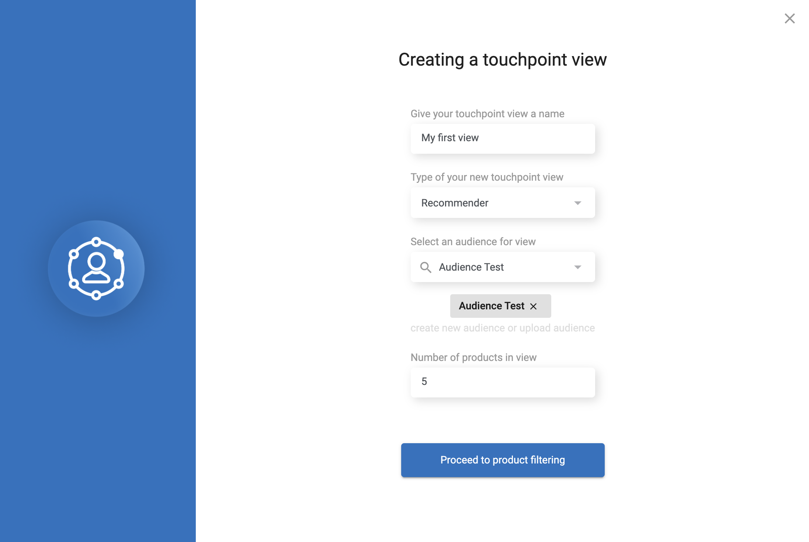

# Touchpoint Studio

For full API documentation for Touchpoint visit api.thingsolver.com

## Overview

Touchpoint studio is ... @biznis da opise  

Solver Touchpoint Studio allows you to automatically setup marketing campaigns and banners at your e-commerce or a website in order to double your CTR. This tools enables you to eliminate manual product sorting and run automatic promotional campaigns over your website touchpoints, recommending the right product to the appropriate website user so you do not need to worry anymore about upsell and cross sell opportunities.

On each channel of communication, it is possible to define an exact position for displaying:

* Home page of the website
* Steps in the checkout process
* Mobile app (exact page)
* Anywhere on the website

## Channels 

- :fontawesome-brands-html5: __HTML__ for content and structure
- :fontawesome-brands-js: __JavaScript__ for interactivity
- :fontawesome-brands-css3: __CSS__ for text running out of boxes
- :fontawesome-brands-internet-explorer: __Internet Explorer__ ... huh?

### Prerequisites

###The flow of creating a Touchpoint

Touchpoint View is a combination of a place where the View will be shown with rules that are set in some of the Touchpoint. 
To create a new touchpoint view user should set: 
* Name of Touchpoint view
* In which Touchpoint the view will show
* Audience for view (the pool of customer to whom the view will be visible)
* Number of products in view (min and max value)

**Product Filtering** 

On the left side, similar to the funnel in Audience Studio, there is a preview of the most important information such as View location, View Audience, and View number of products. In this part, there is also an option to edit some of the settings without going back to the previous step.

In this step, you can set the rules for each product’s space in the certain View. 

If you don’t want to manually set filters for some product, at any time you can use our recommender model to get the best match for the certain Audience. 

When creating filters, user should define following parameters: 
* Type of filter (example: brand, price, category, supplier etc)
* Define chosen filter or a mix of filters
* Add or exclude the filter

In case that you want to set the general rules for all products, you can just select the product that you want to follow the same rule. 

Being creative by creating filters for Touchpoint view clients can easily make new conversions on site, or inside the application. 

With defined priorities and targeting the right audience, Touchpoint can bring valuable assets in achieving upsell.
